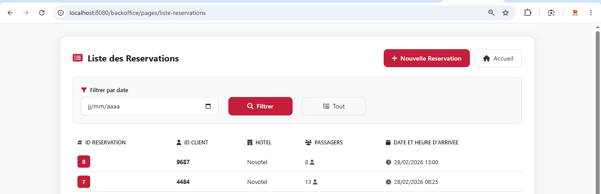
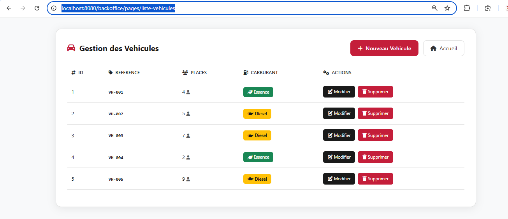
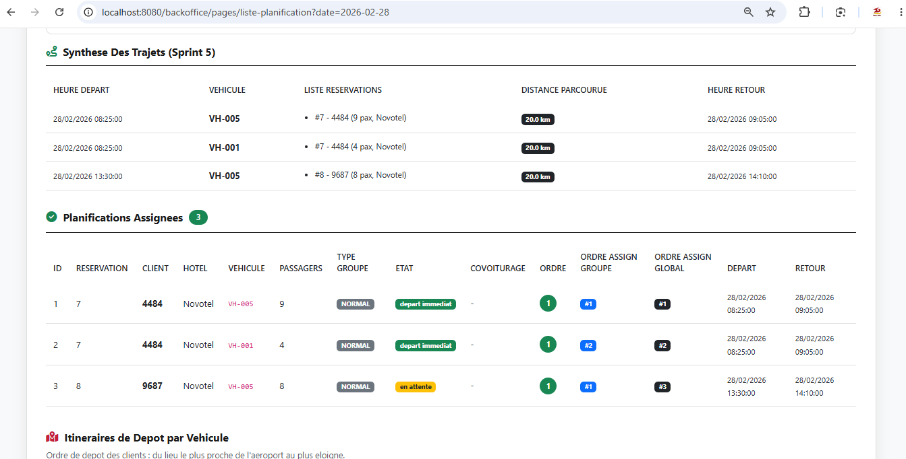

# Hotel BackOffice - Système de Planification & d'Administration 🏨 ⚙️

[](#)
[](#)
[](#)
[](#)
[](#)

Le **BackOffice** est l'application d'administration centrale du système de navettes. Il permet aux administrateurs de planifier les trajets de navettes d'aéroport, de gérer la flotte de véhicules, et de suivre les réservations hôtelières. 

Il est développé à l'aide d'un **framework Web MVC Java personnalisé** (`framework.jar`) fournissant un routage d'annotations et une gestion d'API REST légère.

---

## 🏗️ Structure du Projet (BO)

```
BackOffice/
├── src/
│   ├── main/
│   │   ├── java/
│   │   │   └── com/
│   │   │       └── hotel/
│   │   │           ├── controller/       # Contrôleurs REST et pages (Framework Annotations)
│   │   │           ├── model/            # Modèles métier et entités
│   │   │           ├── service/          # Logique métier et algorithmes d'attribution
│   │   │           └── database/         # Gestionnaire de connexion PostgreSQL
│   │   ├── resources/
│   │   │   └── database.properties       # Configuration de connexion à la base
│   │   └── webapp/
│   │       ├── WEB-INF/
│   │       │   └── web.xml               # Configuration de Tomcat
│   │       ├── index.jsp                # Tableau de bord principal
│   │       ├── formulaire-planification.jsp
│   │       ├── liste-planification.jsp
│   │       ├── liste-reservation-non-assignees.jsp
│   │       └── error.jsp
├── lib/
│   └── framework.jar                     # Framework MVC propriétaire compilé
├── build.bat                             # Script Windows de compilation & déploiement automatique
├── pom.xml                               # Fichier de build Maven
└── projet_hotel.sql                      # Script d'import de base de données PostgreSQL
```

---

## 🛠️ Stack Technique

*   **Runtime** : Java 17.
*   **Framework** : MVC Custom Java (Servlets, JSP, Annotations customisées).
*   **Base de Données** : PostgreSQL 17.
*   **Frontend** : HTML5, CSS3, Bootstrap 5, Vanilla JavaScript.
*   **Build & Serveur** : Maven 3.9 & Apache Tomcat 10.1+.

---

## 🚀 Fonctionnalités & API

### 💻 Interfaces d'Administration
*   **Tableau de Bord** (`/`) : Menu d'accueil.
*   **Formulaire de Planification** (`/formulaire-planification`) : Recherche par date pour planifier les navettes (`getPlanificationsByDate(Date date)`).
*   **File d'Attente** (`/liste-reservation-non-assignees`) : Affiche les arrivées de vol sans navette. Permet de déclencher l'assignation automatique.

### 📐 Algorithme d'Assignation
L'assignation applique de façon synchrone les règles métier suivantes :
1.  **Optimisation de l'espace** : Choix du véhicule dont la capacité est supérieure ou égale au nombre de passagers, en minimisant l'espace vide.
2.  **Choix Énergétique** : Priorité aux motorisations **Diesel** (`type_carburant = 'D'`) en cas d'égalité de capacité disponible.
3.  **Vérification de Disponibilité** : Aucun trajet du véhicule ne doit chevaucher le créneau horaire `[Départ Aéroport, Retour Aéroport]`.
    *   *Départ* = `Arrivée Vol` - `Durée Trajet`
    *   *Retour* = `Arrivée Vol` + `Durée Trajet`
    *   *Durée Trajet* = `Distance` / `Vitesse Moyenne (30 km/h)`

### 🔌 API REST

#### Hôtels
-   `GET /hotels` : Liste de l'ensemble des hôtels.

#### Réservations
-   `GET /reservations` : Récupère la liste de toutes les réservations.
-   `GET /reservations?date=YYYY-MM-DD` : Filtre les réservations pour une date donnée.
-   `POST /reservations` : Crée une nouvelle réservation.
    *   *Paramètres* : `id_client` (4 chiffres), `nb_passager`, `date_heure_arrivee` (ISO: YYYY-MM-DDTHH:mm), `id_hotel`.

---

## 🔀 Workflow Git & Rôles

Le BackOffice suit la politique d'intégration de l'équipe :
*   Les développements se font sur des branches nommées `Feature/` (ex. `Feature/AssignationAlgorithme`).
*   Toute intégration sur `main` s'effectue via une **Merge Request (MR)** après révision et approbation par le **Team Lead** (rotation Mike / Vicky / Jordi).
*   Le déploiement final s'effectue sur la branche `release/prod` (hébergée sur Railway), disposant d'un schéma PostgreSQL dédié. Les hotfixes de production sont répercutés via du **Cherry-Picking**.

*(Voir le [README principal à la racine](../README.md) pour plus de détails sur le cycle complet).*

---

## 💾 Installation et Lancement

### 1. Base de données
```bash
createdb hotel_db
psql -U postgres -d hotel_db -f projet_hotel.sql
```

### 2. Configuration
Modifier `src/main/resources/database.properties` avec vos identifiants PostgreSQL.

### 3. Compilation et Déploiement

#### Automatique (Windows) :
Double-cliquez sur `build.bat` pour nettoyer, packager le WAR et le copier sur Tomcat.

#### Manuel :
```bash
mvn clean package
cp target/backoffice.war $TOMCAT_HOME/webapps/
```

### 🔗 Accès
[http://localhost:8080/backoffice/pages/](http://localhost:8080/backoffice/pages/)

---

## 🛠️ Dépannage (Troubleshooting)

*   **Erreur 404** : Vérifiez que Tomcat est démarré et que le dossier webapps contient bien `backoffice.war` ou le répertoire extrait `backoffice/`.
*   **Erreur de compilation Framework** : Le framework custom `framework.jar` doit être présent dans le dossier `/lib`. Maven l'importe via un `<scope>system</scope>`.
*   **Erreur de Driver PGSQL** : Si des erreurs de connexion SQL surviennent au démarrage de Tomcat, assurez-vous que les dépendances Jackson et PostgreSQL sont bien résolues par Maven.

---

## 📸 Screenshots

### Liste des réservations


### Liste des véhicules


### Résultat de planification

